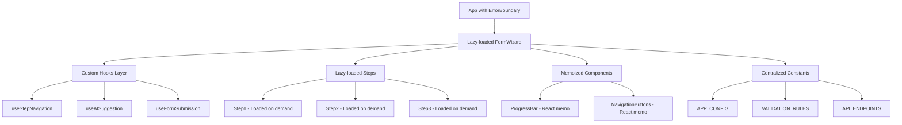

# Design Document

## Overview

This design document outlines the optimization strategy for the Social Support Portal application. The focus is on improving code quality, performance, maintainability, and developer experience without altering core functionality. The optimizations target bundle size reduction (from 618KB to <500KB), better code organization through custom hooks, comprehensive error handling, enhanced type safety, and improved development tooling.

## Architecture Changes

### Current Architecture Issues

1. **Large Bundle Size**: 618.64 KB minified (199.08 KB gzipped) - exceeds recommended 500KB limit
2. **Monolithic Components**: FormWizard component handles too many responsibilities
3. **No Error Boundaries**: Single error can crash entire application
4. **Scattered Constants**: Magic strings and configuration values throughout codebase
5. **Limited Type Safety**: Some `any` types and type assertions present
6. **No Code Splitting**: All code loaded upfront regardless of usage

### Proposed Architecture Improvements



## Bundle Size Optimization Strategy

### 1. Code Splitting Implementation

**Approach**: Use React.lazy() and Suspense for dynamic imports

**Target Components**:

- Step components (Step1, Step2, Step3)
- Success page
- AI suggestion modal (when not in use)

**Expected Impact**: Reduce initial bundle by ~150-200KB

**Implementation**:

```typescript
// src/components/FormWizard.tsx
import { lazy, Suspense } from "react";
import FormSkeleton from "./common/FormSkeleton";

const Step1PersonalInfo = lazy(() => import("./steps/Step1PersonalInfo"));
const Step2FamilyFinancial = lazy(() => import("./steps/Step2FamilyFinancial"));
const Step3SituationDescriptions = lazy(
  () => import("./steps/Step3SituationDescriptions")
);
const SuccessPage = lazy(() => import("./SuccessPage"));

// Render with Suspense
<Suspense fallback={<FormSkeleton />}>{renderStep()}</Suspense>;
```

### 2. Tree Shaking Optimization

**Current Issue**: Barrel imports from MUI may include unused code

**Solution**: Use direct imports

```typescript
// ❌ Before (may include unused code)
import { Button, TextField, Box } from "@mui/material";

// ✅ After (tree-shakeable)
import Button from "@mui/material/Button";
import TextField from "@mui/material/TextField";
import Box from "@mui/material/Box";
```

### 3. Translation File Splitting

**Approach**: Load only active language

```typescript
// src/i18n/config.ts
const loadLanguageResources = async (language: string) => {
  const resources = await import(`./locales/${language}.json`);
  return resources.default;
};
```

### 4. Vite Build Configuration

**Add to vite.config.ts**:

```typescript
export default defineConfig({
  build: {
    rollupOptions: {
      output: {
        manualChunks: {
          "react-vendor": ["react", "react-dom", "react-router-dom"],
          "mui-vendor": ["@mui/material", "@mui/icons-material"],
          "form-vendor": ["react-hook-form", "yup", "@hookform/resolvers"],
          "i18n-vendor": ["i18next", "react-i18next"],
        },
      },
    },
    chunkSizeWarningLimit: 500,
  },
});
```

**Expected Bundle Breakdown**:

- Main bundle: ~150KB
- React vendor: ~130KB
- MUI vendor: ~150KB
- Form vendor: ~50KB
- I18n vendor: ~30KB
- Total: ~510KB (before gzip) → ~180KB (gzipped)

## Custom Hooks Architecture

### 1. useStepNavigation Hook

**Purpose**: Extract step navigation logic from FormWizard

**Interface**:

```typescript
interface UseStepNavigationReturn {
  currentStep: FormStep;
  canGoNext: boolean;
  canGoPrevious: boolean;
  handleNext: () => Promise<void>;
  handlePrevious: () => void;
  goToStep: (step: FormStep) => void;
}

export const useStepNavigation = (): UseStepNavigationReturn => {
  // Implementation
};
```

**Benefits**:

- Reduces FormWizard complexity
- Testable in isolation
- Reusable across components

### 2. useAISuggestion Hook

**Purpose**: Encapsulate AI suggestion logic

**Interface**:

```typescript
interface UseAISuggestionReturn {
  suggestion: string | null;
  isLoading: boolean;
  error: AIError | null;
  generateSuggestion: (fieldName: keyof ApplicationFormData) => Promise<void>;
  acceptSuggestion: () => void;
  editSuggestion: (text: string) => void;
  discardSuggestion: () => void;
  retry: () => Promise<void>;
}

export const useAISuggestion = (
  fieldName: keyof ApplicationFormData
): UseAISuggestionReturn => {
  // Implementation
};
```

**Benefits**:

- Separates AI logic from UI
- Easier to test and mock
- Cleaner component code

### 3. useFormSubmission Hook

**Purpose**: Handle form submission logic

**Interface**:

```typescript
interface UseFormSubmissionReturn {
  isSubmitting: boolean;
  isSuccess: boolean;
  error: string | null;
  submissionData: SubmissionResponse | null;
  submitForm: () => Promise<void>;
  resetSubmission: () => void;
}

export const useFormSubmission = (): UseFormSubmissionReturn => {
  // Implementation
};
```

**Benefits**:

- Cleaner FormWizard component
- Testable submission logic
- Reusable for future forms

## Error Boundary Implementation

### ErrorBoundary Component Design

**File**: `src/components/common/ErrorBoundary.tsx`

**Features**:

- Catch JavaScript errors in child components
- Display user-friendly error UI
- Log errors for debugging
- Provide reset mechanism
- Support for different error types (network, validation, runtime)

**Implementation**:

```typescript
interface ErrorBoundaryProps {
  children: ReactNode;
  fallback?: ReactNode;
  onError?: (error: Error, errorInfo: ErrorInfo) => void;
}

interface ErrorBoundaryState {
  hasError: boolean;
  error: Error | null;
}

class ErrorBoundary extends Component<ErrorBoundaryProps, ErrorBoundaryState> {
  static getDerivedStateFromError(error: Error): ErrorBoundaryState {
    return { hasError: true, error };
  }

  componentDidCatch(error: Error, errorInfo: ErrorInfo) {
    // Log to console in development
    console.error("ErrorBoundary caught:", error, errorInfo);

    // Call custom error handler
    this.props.onError?.(error, errorInfo);

    // In production, send to error tracking service
    // logErrorToService(error, errorInfo);
  }

  handleReset = () => {
    this.setState({ hasError: false, error: null });
  };

  render() {
    if (this.state.hasError) {
      return (
        this.props.fallback || (
          <ErrorFallback error={this.state.error} onReset={this.handleReset} />
        )
      );
    }

    return this.props.children;
  }
}
```

**Error Fallback UI**:

```typescript
interface ErrorFallbackProps {
  error: Error | null;
  onReset: () => void;
}

const ErrorFallback: React.FC<ErrorFallbackProps> = ({ error, onReset }) => (
  <Container maxWidth="sm" sx={{ mt: 8, textAlign: "center" }}>
    <ErrorOutlineIcon sx={{ fontSize: 64, color: "error.main", mb: 2 }} />
    <Typography variant="h4" gutterBottom>
      {t("error.somethingWentWrong")}
    </Typography>
    <Typography variant="body1" color="text.secondary" sx={{ mb: 3 }}>
      {t("error.pleaseTryAgain")}
    </Typography>
    {error && (
      <Alert severity="error" sx={{ mb: 3, textAlign: "left" }}>
        {error.message}
      </Alert>
    )}
    <Button variant="contained" onClick={onReset}>
      {t("error.retry")}
    </Button>
  </Container>
);
```

**Usage**:

```typescript
// src/App.tsx
<ErrorBoundary>
  <FormProvider>
    <FormWizard />
  </FormProvider>
</ErrorBoundary>
```

## Constants Consolidation

### File Structure

```
src/constants/
├── app.ts          # Application-wide constants
├── storage.ts      # LocalStorage keys
├── api.ts          # API endpoints and configuration
├── validation.ts   # Validation rules and constraints
└── index.ts        # Re-export all constants
```

### Constants Definitions

**src/constants/app.ts**:

```typescript
export const APP_CONFIG = {
  DEBOUNCE_DELAY: 2000,
  AI_TIMEOUT: 30000,
  FORM_STEPS: 3,
  MAX_FILE_SIZE: 5 * 1024 * 1024, // 5MB
} as const;

export const BREAKPOINTS = {
  MOBILE: 768,
  TABLET: 1024,
  DESKTOP: 1440,
} as const;
```

**src/constants/storage.ts**:

```typescript
export const STORAGE_KEYS = {
  FORM_DATA: "socialSupportForm",
  CURRENT_STEP: "socialSupportFormStep",
  LANGUAGE: "language",
  COMPLETION_PERCENTAGE: "completionPercentage",
} as const;
```

**src/constants/api.ts**:

```typescript
export const API_CONFIG = {
  OPENAI_URL: "https://api.openai.com/v1/chat/completions",
  MOCK_API_DELAY: 1500,
  REQUEST_TIMEOUT: 30000,
} as const;

export const API_ENDPOINTS = {
  SUBMIT_APPLICATION: "/api/applications",
  VALIDATE_NATIONAL_ID: "/api/validate/national-id",
} as const;
```

**src/constants/validation.ts**:

```typescript
export const VALIDATION_RULES = {
  MIN_TEXT_LENGTH: 50,
  MAX_TEXT_LENGTH: 1000,
  MIN_AGE: 18,
  MAX_AGE: 120,
  PHONE_REGEX: /^[+]?[(]?[0-9]{3}[)]?[-\s.]?[0-9]{3}[-\s.]?[0-9]{4,6}$/,
} as const;

export const FIELD_CONSTRAINTS = {
  name: { min: 2, max: 100 },
  nationalId: { min: 10, max: 20 },
  address: { min: 10, max: 200 },
  dependents: { min: 0, max: 20 },
  monthlyIncome: { min: 0, max: 1000000 },
} as const;
```

## Type Safety Improvements

### 1. Eliminate `any` Types

**Strategy**: Replace with proper types or generics

```typescript
// ❌ Before
const handleChange = (field: string, value: any) => {
  updateFormData(field, value);
};

// ✅ After
const handleChange = <K extends keyof ApplicationFormData>(
  field: K,
  value: ApplicationFormData[K]
) => {
  updateFormData(field, value);
};
```

### 2. Remove @ts-ignore Comments

**Strategy**: Fix underlying type issues

```typescript
// ❌ Before
// @ts-ignore
form.setValue(field, value);

// ✅ After
form.setValue(field, value as ApplicationFormData[typeof field]);
```

### 3. Strict API Response Types

```typescript
export interface APIResponse<T = unknown> {
  success: boolean;
  data?: T;
  error?: {
    code: string;
    message: string;
  };
  timestamp: string;
}

export interface SubmissionResponse {
  applicationId: string;
  timestamp: string;
  status: "pending" | "approved" | "rejected";
}

// Usage
const response: APIResponse<SubmissionResponse> =
  await APIService.submitApplication(formData);
```

### 4. TypeScript Configuration

**Update tsconfig.json**:

```json
{
  "compilerOptions": {
    "strict": true,
    "noImplicitAny": true,
    "strictNullChecks": true,
    "strictFunctionTypes": true,
    "noUnusedLocals": true,
    "noUnusedParameters": true,
    "noImplicitReturns": true,
    "noFallthroughCasesInSwitch": true
  }
}
```

## Input Sanitization

### Sanitization Utility

**File**: `src/utils/sanitize.ts`

```typescript
export interface SanitizeOptions {
  allowHtml?: boolean;
  maxLength?: number;
  trim?: boolean;
}

export const sanitizeInput = (
  input: string,
  options: SanitizeOptions = {}
): string => {
  const { allowHtml = false, maxLength, trim = true } = options;

  let sanitized = input;

  // Trim whitespace
  if (trim) {
    sanitized = sanitized.trim();
  }

  // Remove HTML tags if not allowed
  if (!allowHtml) {
    sanitized = sanitized.replace(/<[^>]*>/g, "");
  }

  // Remove potentially dangerous characters
  sanitized = sanitized.replace(/[<>]/g, "");

  // Limit length
  if (maxLength && sanitized.length > maxLength) {
    sanitized = sanitized.substring(0, maxLength);
  }

  return sanitized;
};

export const sanitizeFormData = (
  data: Partial<ApplicationFormData>
): Partial<ApplicationFormData> => {
  const sanitized: Partial<ApplicationFormData> = {};

  for (const [key, value] of Object.entries(data)) {
    if (typeof value === "string") {
      sanitized[key as keyof ApplicationFormData] = sanitizeInput(value);
    } else {
      sanitized[key as keyof ApplicationFormData] = value;
    }
  }

  return sanitized;
};
```

**Integration Points**:

1. Before saving to localStorage
2. Before API submission
3. After receiving AI-generated content
4. On form field blur events

## Loading States Enhancement

### Skeleton Loader Components

**File**: `src/components/common/SkeletonLoader.tsx`

```typescript
export const FormSkeleton: React.FC = () => (
  <Stack spacing={3}>
    {Array.from({ length: 5 }).map((_, i) => (
      <Box key={i}>
        <Skeleton variant="text" width="30%" height={24} sx={{ mb: 1 }} />
        <Skeleton variant="rectangular" height={56} />
      </Box>
    ))}
  </Stack>
);

export const ModalSkeleton: React.FC = () => (
  <Box sx={{ p: 3 }}>
    <Skeleton variant="text" width="60%" height={32} sx={{ mb: 2 }} />
    <Skeleton variant="rectangular" height={200} sx={{ mb: 2 }} />
    <Stack direction="row" spacing={2} justifyContent="flex-end">
      <Skeleton variant="rectangular" width={100} height={36} />
      <Skeleton variant="rectangular" width={100} height={36} />
    </Stack>
  </Box>
);

export const ProgressSkeleton: React.FC = () => (
  <Box sx={{ mb: 4 }}>
    <Skeleton variant="rectangular" height={8} sx={{ mb: 2 }} />
    <Stack direction="row" spacing={2}>
      {Array.from({ length: 3 }).map((_, i) => (
        <Skeleton key={i} variant="circular" width={40} height={40} />
      ))}
    </Stack>
  </Box>
);
```

**Usage with Suspense**:

```typescript
<Suspense fallback={<FormSkeleton />}>
  <Step1PersonalInfo />
</Suspense>
```

## Progress Indicators Enhancement

### Completion Percentage Calculation

**File**: `src/utils/progress.ts`

```typescript
export const calculateCompletionPercentage = (
  formData: Partial<ApplicationFormData>
): number => {
  const requiredFields: (keyof ApplicationFormData)[] = [
    "name",
    "nationalId",
    "dateOfBirth",
    "gender",
    "address",
    "city",
    "state",
    "country",
    "phone",
    "email",
    "maritalStatus",
    "dependents",
    "employmentStatus",
    "monthlyIncome",
    "housingStatus",
    "financialSituation",
    "employmentCircumstances",
    "reasonForApplying",
  ];

  const filledFields = requiredFields.filter((field) => {
    const value = formData[field];
    if (typeof value === "string") {
      return value.trim().length > 0;
    }
    return value !== undefined && value !== null;
  });

  return Math.round((filledFields.length / requiredFields.length) * 100);
};

export const calculateStepCompletion = (
  step: FormStep,
  formData: Partial<ApplicationFormData>
): number => {
  const stepFields: Record<FormStep, (keyof ApplicationFormData)[]> = {
    1: [
      "name",
      "nationalId",
      "dateOfBirth",
      "gender",
      "address",
      "city",
      "state",
      "country",
      "phone",
      "email",
    ],
    2: [
      "maritalStatus",
      "dependents",
      "employmentStatus",
      "monthlyIncome",
      "housingStatus",
    ],
    3: ["financialSituation", "employmentCircumstances", "reasonForApplying"],
  };

  const fields = stepFields[step];
  const filledFields = fields.filter((field) => {
    const value = formData[field];
    if (typeof value === "string") {
      return value.trim().length > 0;
    }
    return value !== undefined && value !== null;
  });

  return Math.round((filledFields.length / fields.length) * 100);
};
```

### Enhanced ProgressBar Component

```typescript
interface ProgressBarProps {
  currentStep: FormStep;
  totalSteps: number;
  completionPercentage?: number;
}

const ProgressBar: React.FC<ProgressBarProps> = ({
  currentStep,
  totalSteps,
  completionPercentage,
}) => {
  return (
    <Box sx={{ mb: 4 }}>
      {/* Overall completion */}
      {completionPercentage !== undefined && (
        <Box sx={{ mb: 2 }}>
          <Typography variant="body2" color="text.secondary">
            {t("progress.overallCompletion")}: {completionPercentage}%
          </Typography>
          <LinearProgress
            variant="determinate"
            value={completionPercentage}
            sx={{ height: 8, borderRadius: 4 }}
          />
        </Box>
      )}

      {/* Step indicators */}
      <Stepper activeStep={currentStep - 1}>{/* Step content */}</Stepper>
    </Box>
  );
};
```

## Field-Level Success Indicators

### Enhanced FormField Component

**File**: `src/components/common/FormField.tsx`

```typescript
interface FormFieldProps {
  name: string;
  label: string;
  value: string | number;
  error?: string;
  onChange: (value: string | number) => void;
  // ... other props
}

const getFieldStatus = (
  value: string | number,
  error?: string
): "default" | "success" | "error" => {
  if (error) return "error";
  if (value && !error) return "success";
  return "default";
};

const FormField: React.FC<FormFieldProps> = ({
  name,
  label,
  value,
  error,
  onChange,
  ...props
}) => {
  const status = getFieldStatus(value, error);

  return (
    <TextField
      name={name}
      label={label}
      value={value}
      error={status === "error"}
      helperText={error}
      onChange={(e) => onChange(e.target.value)}
      InputProps={{
        endAdornment: (
          <InputAdornment position="end">
            {status === "success" && (
              <CheckCircleIcon color="success" aria-label="Valid input" />
            )}
            {status === "error" && (
              <ErrorIcon color="error" aria-label="Invalid input" />
            )}
          </InputAdornment>
        ),
      }}
      {...props}
    />
  );
};
```

## Development Tooling

### 1. ESLint Configuration

**File**: `.eslintrc.json`

```json
{
  "extends": [
    "eslint:recommended",
    "plugin:@typescript-eslint/recommended",
    "plugin:react/recommended",
    "plugin:react-hooks/recommended"
  ],
  "parser": "@typescript-eslint/parser",
  "plugins": ["@typescript-eslint", "react", "react-hooks"],
  "rules": {
    "no-console": ["warn", { "allow": ["warn", "error"] }],
    "@typescript-eslint/no-unused-vars": "error",
    "@typescript-eslint/no-explicit-any": "error",
    "@typescript-eslint/explicit-function-return-type": "off",
    "react/react-in-jsx-scope": "off",
    "react-hooks/rules-of-hooks": "error",
    "react-hooks/exhaustive-deps": "warn"
  }
}
```

### 2. Prettier Configuration

**File**: `.prettierrc`

```json
{
  "semi": true,
  "trailingComma": "es5",
  "singleQuote": true,
  "printWidth": 80,
  "tabWidth": 2,
  "useTabs": false,
  "arrowParens": "always"
}
```

### 3. Husky Pre-commit Hooks

**Setup**:

```bash
npm install --save-dev husky lint-staged
npx husky install
npx husky add .husky/pre-commit "npx lint-staged"
```

**File**: `.lintstagedrc.json`

```json
{
  "*.{ts,tsx}": ["eslint --fix", "prettier --write"],
  "*.{json,md}": ["prettier --write"]
}
```

### 4. VS Code Settings

**File**: `.vscode/settings.json`

```json
{
  "editor.formatOnSave": true,
  "editor.defaultFormatter": "esbenp.prettier-vscode",
  "editor.codeActionsOnSave": {
    "source.fixAll.eslint": true
  },
  "typescript.tsdk": "node_modules/typescript/lib",
  "typescript.enablePromptUseWorkspaceTsdk": true
}
```

## Performance Monitoring

### Performance Utility

**File**: `src/utils/performance.ts`

```typescript
export class PerformanceMonitor {
  private static measurements: Map<string, number[]> = new Map();

  static measure<T>(name: string, fn: () => T): T {
    const start = performance.now();
    const result = fn();
    const end = performance.now();
    const duration = end - start;

    // Store measurement
    if (!this.measurements.has(name)) {
      this.measurements.set(name, []);
    }
    this.measurements.get(name)!.push(duration);

    // Log in development
    if (import.meta.env.DEV) {
      console.log(`⏱️ ${name}: ${duration.toFixed(2)}ms`);
    }

    return result;
  }

  static async measureAsync<T>(name: string, fn: () => Promise<T>): Promise<T> {
    const start = performance.now();
    const result = await fn();
    const end = performance.now();
    const duration = end - start;

    // Store measurement
    if (!this.measurements.has(name)) {
      this.measurements.set(name, []);
    }
    this.measurements.get(name)!.push(duration);

    // Log in development
    if (import.meta.env.DEV) {
      console.log(`⏱️ ${name}: ${duration.toFixed(2)}ms`);
    }

    return result;
  }

  static getStats(name: string) {
    const measurements = this.measurements.get(name) || [];
    if (measurements.length === 0) return null;

    const avg = measurements.reduce((a, b) => a + b, 0) / measurements.length;
    const min = Math.min(...measurements);
    const max = Math.max(...measurements);

    return { avg, min, max, count: measurements.length };
  }

  static logAllStats() {
    console.table(
      Array.from(this.measurements.keys()).map((name) => ({
        name,
        ...this.getStats(name),
      }))
    );
  }
}

// Usage
const result = await PerformanceMonitor.measureAsync(
  "AI Suggestion Generation",
  () => openAIService.generateSuggestion(fieldName, formData)
);
```

## Component Memoization Strategy

### Components to Memoize

1. **ProgressBar**: Re-renders on every form change
2. **NavigationButtons**: Re-renders on every form change
3. **LanguageSelector**: Static component
4. **FormField**: Individual fields

### Implementation

```typescript
// src/components/common/ProgressBar.tsx
export default React.memo(ProgressBar, (prevProps, nextProps) => {
  return (
    prevProps.currentStep === nextProps.currentStep &&
    prevProps.completionPercentage === nextProps.completionPercentage
  );
});

// src/components/common/NavigationButtons.tsx
export default React.memo(NavigationButtons);

// src/components/common/LanguageSelector.tsx
export default React.memo(LanguageSelector);
```

### Hook Optimization

```typescript
// Use useCallback for event handlers
const handleNext = useCallback(async () => {
  const isValid = await validateCurrentStep();
  if (isValid && currentStep < 3) {
    setCurrentStep((currentStep + 1) as FormStep);
  }
}, [currentStep, validateCurrentStep, setCurrentStep]);

// Use useMemo for expensive computations
const completionPercentage = useMemo(
  () => calculateCompletionPercentage(formData),
  [formData]
);
```

## Testing Strategy

### Unit Tests (Not in scope but documented)

- Custom hooks testing with @testing-library/react-hooks
- Utility functions testing (sanitization, progress calculation)
- Service layer testing with mocked dependencies

### Integration Tests (Not in scope but documented)

- Error boundary behavior
- Code splitting and lazy loading
- Form submission with all optimizations

## Migration Strategy

### Phase 1: Foundation (Low Risk)

1. Add constants consolidation
2. Implement type safety improvements
3. Add input sanitization
4. Configure development tooling

### Phase 2: Performance (Medium Risk)

1. Implement code splitting
2. Add component memoization
3. Optimize bundle configuration
4. Add performance monitoring

### Phase 3: Architecture (Higher Risk)

1. Extract custom hooks
2. Implement error boundaries
3. Add loading states
4. Enhance progress indicators

### Rollback Plan

- Keep original code in separate branch
- Test each phase thoroughly before proceeding
- Monitor bundle size and performance metrics
- Have feature flags for new optimizations

## Expected Outcomes

### Performance Metrics

| Metric                 | Current | Target  | Improvement |
| ---------------------- | ------- | ------- | ----------- |
| Bundle Size (minified) | 618 KB  | <500 KB | -19%        |
| Bundle Size (gzipped)  | 199 KB  | <180 KB | -10%        |
| Initial Load Time      | ~3s     | <2s     | -33%        |
| Time to Interactive    | ~4s     | <3s     | -25%        |

### Code Quality Metrics

| Metric                 | Current | Target |
| ---------------------- | ------- | ------ |
| TypeScript Strict Mode | Partial | Full   |
| ESLint Errors          | Unknown | 0      |
| Code Duplication       | Medium  | Low    |
| Component Complexity   | High    | Medium |

### Developer Experience

- Faster development with better tooling
- Fewer bugs with improved type safety
- Easier maintenance with better code organization
- Consistent code style with automated formatting

## Conclusion

This design provides a comprehensive optimization strategy that balances performance improvements with code quality enhancements. The phased approach minimizes risk while delivering measurable improvements in bundle size, load time, and developer experience. All optimizations maintain backward compatibility and existing functionality.
