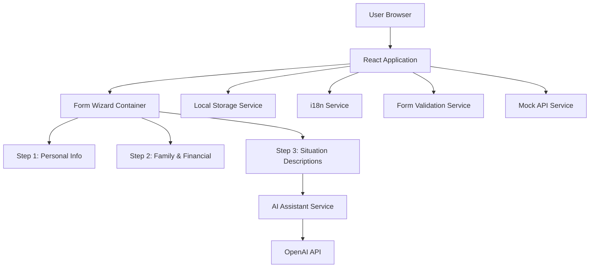

# Design Document

## Overview

The Social Support Portal is a React-based single-page application that implements a three-step form wizard for financial assistance applications. The architecture follows a component-based design with centralized state management, form validation, internationalization support, and OpenAI API integration for AI-assisted text generation.

## Architecture

### High-Level Architecture



### Technology Stack

- **Framework**: React 18+ with TypeScript
- **UI Library**: Material-UI (MUI) v5
- **Form Management**: React Hook Form with Yup validation
- **State Management**: React Context API
- **Routing**: React Router v6
- **Internationalization**: react-i18next
- **HTTP Client**: Axios
- **Styling**: MUI styled-components with theme support
- **Build Tool**: Vite

### Project Structure

```
src/
├── components/
│   ├── FormWizard/
│   │   ├── FormWizard.tsx
│   │   ├── ProgressBar.tsx
│   │   └── NavigationButtons.tsx
│   ├── Steps/
│   │   ├── Step1PersonalInfo.tsx
│   │   ├── Step2FamilyFinancial.tsx
│   │   └── Step3SituationDescriptions.tsx
│   ├── AIAssistant/
│   │   ├── HelpMeWriteButton.tsx
│   │   └── SuggestionModal.tsx
│   └── common/
│       ├── LanguageSelector.tsx
│       └── FormField.tsx
├── contexts/
│   ├── FormContext.tsx
│   └── LanguageContext.tsx
├── services/
│   ├── openai.service.ts
│   ├── storage.service.ts
│   └── api.service.ts
├── hooks/
│   ├── useFormPersistence.ts
│   └── useAIAssistant.ts
├── types/
│   └── form.types.ts
├── validation/
│   └── schemas.ts
├── i18n/
│   ├── config.ts
│   ├── en.json
│   └── ar.json
├── theme/
│   └── theme.ts
└── App.tsx
```

## Components and Interfaces

### Core Components

#### 1. FormWizard Component

**Purpose**: Main container managing the multi-step form flow

**Props**:

```typescript
interface FormWizardProps {
  onSubmit: (data: ApplicationFormData) => Promise<void>;
}
```

**State**:

- Current step index (0-2)
- Form data for all steps
- Validation errors
- Submission status

**Responsibilities**:

- Render current step component
- Handle step navigation
- Coordinate form validation
- Trigger data persistence
- Handle final submission

#### 2. ProgressBar Component

**Purpose**: Visual indicator of form completion progress

**Props**:

```typescript
interface ProgressBarProps {
  currentStep: number;
  totalSteps: number;
  stepLabels: string[];
}
```

**Rendering**:

- Horizontal stepper on desktop
- Compact indicator on mobile
- Completed/active/inactive step states

#### 3. Step Components (Step1, Step2, Step3)

**Purpose**: Render form fields for each step

**Common Props**:

```typescript
interface StepProps {
  data: Partial<ApplicationFormData>;
  onDataChange: (data: Partial<ApplicationFormData>) => void;
  errors: Record<string, string>;
}
```

**Step 1 Fields**:

- Text inputs: name, nationalId, address, city, state, country, phone, email
- Date picker: dateOfBirth
- Select: gender

**Step 2 Fields**:

- Select: maritalStatus, employmentStatus, housingStatus
- Number inputs: dependents, monthlyIncome

**Step 3 Fields**:

- Textarea with AI assistance: financialSituation, employmentCircumstances, reasonForApplying

#### 4. HelpMeWriteButton Component

**Purpose**: Trigger AI text generation

**Props**:

```typescript
interface HelpMeWriteButtonProps {
  fieldName: string;
  currentValue: string;
  onSuggestionAccepted: (text: string) => void;
}
```

**Behavior**:

- Disabled state during API call
- Loading indicator
- Error state display

#### 5. SuggestionModal Component

**Purpose**: Display AI-generated text with action options

**Props**:

```typescript
interface SuggestionModalProps {
  open: boolean;
  suggestion: string;
  loading: boolean;
  error: string | null;
  onAccept: () => void;
  onEdit: () => void;
  onDiscard: () => void;
  onRetry: () => void;
}
```

**Features**:

- Editable textarea for suggestion
- Action buttons (Accept, Edit, Discard)
- Error display with retry option
- Loading state

#### 6. LanguageSelector Component

**Purpose**: Toggle between English and Arabic

**Props**:

```typescript
interface LanguageSelectorProps {
  currentLanguage: string;
  onLanguageChange: (language: string) => void;
}
```

**Implementation**:

- Dropdown or toggle button
- Flag icons for visual identification
- Persists selection to localStorage

## Data Models

### Application Form Data

```typescript
interface ApplicationFormData {
  // Step 1: Personal Information
  name: string;
  nationalId: string;
  dateOfBirth: Date;
  gender: "male" | "female" | "other";
  address: string;
  city: string;
  state: string;
  country: string;
  phone: string;
  email: string;

  // Step 2: Family & Financial
  maritalStatus: "single" | "married" | "divorced" | "widowed";
  dependents: number;
  employmentStatus: "employed" | "unemployed" | "self-employed" | "retired";
  monthlyIncome: number;
  housingStatus: "owned" | "rented" | "homeless" | "other";

  // Step 3: Situation Descriptions
  financialSituation: string;
  employmentCircumstances: string;
  reasonForApplying: string;
}
```

### Validation Schema

```typescript
// Using Yup for validation
const step1Schema = yup.object({
  name: yup.string().required("validation.required"),
  nationalId: yup.string().required("validation.required"),
  dateOfBirth: yup
    .date()
    .max(new Date(), "validation.dateInPast")
    .required("validation.required"),
  gender: yup.string().required("validation.required"),
  address: yup.string().required("validation.required"),
  city: yup.string().required("validation.required"),
  state: yup.string().required("validation.required"),
  country: yup.string().required("validation.required"),
  phone: yup
    .string()
    .matches(
      /^[+]?[(]?[0-9]{3}[)]?[-\s.]?[0-9]{3}[-\s.]?[0-9]{4,6}$/,
      "validation.invalidPhone"
    )
    .required("validation.required"),
  email: yup
    .string()
    .email("validation.invalidEmail")
    .required("validation.required"),
});

const step2Schema = yup.object({
  maritalStatus: yup.string().required("validation.required"),
  dependents: yup
    .number()
    .min(0, "validation.nonNegative")
    .required("validation.required"),
  employmentStatus: yup.string().required("validation.required"),
  monthlyIncome: yup
    .number()
    .min(0, "validation.nonNegative")
    .required("validation.required"),
  housingStatus: yup.string().required("validation.required"),
});

const step3Schema = yup.object({
  financialSituation: yup
    .string()
    .min(50, "validation.minLength")
    .required("validation.required"),
  employmentCircumstances: yup
    .string()
    .min(50, "validation.minLength")
    .required("validation.required"),
  reasonForApplying: yup
    .string()
    .min(50, "validation.minLength")
    .required("validation.required"),
});
```

### OpenAI API Request/Response

```typescript
interface OpenAIRequest {
  model: "gpt-3.5-turbo";
  messages: Array<{
    role: "system" | "user";
    content: string;
  }>;
  max_tokens: number;
  temperature: number;
}

interface OpenAIResponse {
  choices: Array<{
    message: {
      content: string;
    };
  }>;
}
```

## Services

### 1. OpenAI Service

**Purpose**: Handle AI text generation requests

```typescript
class OpenAIService {
  private apiKey: string;
  private baseURL: string = "https://api.openai.com/v1";

  async generateSuggestion(
    fieldName: string,
    context: string
  ): Promise<string> {
    // Build prompt based on field name
    // Make API call with timeout (30s)
    // Handle errors and retries
    // Return generated text
  }

  private buildPrompt(fieldName: string, context: string): string {
    // Create contextual prompts for each field
  }
}
```

**Error Handling**:

- Network errors: Display "Connection failed" message
- Timeout (30s): Display "Request timed out" message
- API errors: Display user-friendly error message
- Rate limiting: Display "Too many requests" message

### 2. Storage Service

**Purpose**: Manage localStorage operations

```typescript
class StorageService {
  private storageKey = "social-support-form";

  saveFormData(data: Partial<ApplicationFormData>): void {
    // Serialize and save to localStorage
  }

  loadFormData(): Partial<ApplicationFormData> | null {
    // Load and deserialize from localStorage
  }

  saveCurrentStep(step: number): void {
    // Save current step index
  }

  loadCurrentStep(): number {
    // Load saved step index
  }

  clearFormData(): void {
    // Remove all saved data
  }
}
```

**Debouncing**: Implement 2-second debounce for auto-save to prevent excessive writes

### 3. API Service

**Purpose**: Handle form submission

```typescript
class APIService {
  async submitApplication(
    data: ApplicationFormData
  ): Promise<{ success: boolean; message: string }> {
    // Mock API call with 1-2 second delay
    // Simulate success/failure scenarios
    // Return response
  }
}
```

## State Management

### Form Context

```typescript
interface FormContextValue {
  formData: Partial<ApplicationFormData>;
  currentStep: number;
  updateFormData: (data: Partial<ApplicationFormData>) => void;
  setCurrentStep: (step: number) => void;
  validateCurrentStep: () => Promise<boolean>;
  submitForm: () => Promise<void>;
  errors: Record<string, string>;
}
```

**Provider Responsibilities**:

- Maintain form state
- Coordinate validation
- Trigger persistence
- Handle submission

### Language Context

```typescript
interface LanguageContextValue {
  language: string;
  setLanguage: (lang: string) => void;
  direction: "ltr" | "rtl";
}
```

## Internationalization

### Translation Structure

```json
{
  "common": {
    "next": "Next",
    "previous": "Previous",
    "submit": "Submit",
    "cancel": "Cancel"
  },
  "steps": {
    "personalInfo": "Personal Information",
    "familyFinancial": "Family & Financial Info",
    "situationDescriptions": "Situation Descriptions"
  },
  "fields": {
    "name": "Full Name",
    "nationalId": "National ID"
    // ... all field labels
  },
  "validation": {
    "required": "This field is required",
    "invalidEmail": "Please enter a valid email"
    // ... all validation messages
  },
  "ai": {
    "helpMeWrite": "Help Me Write",
    "generating": "Generating suggestion...",
    "accept": "Accept",
    "edit": "Edit",
    "discard": "Discard",
    "retry": "Retry"
  }
}
```

### RTL Support

- Use MUI's `direction` theme property
- Apply `dir="rtl"` to root element when Arabic is selected
- Use logical CSS properties (margin-inline-start instead of margin-left)
- Mirror layout components (progress bar, navigation buttons)

## Responsive Design

### Breakpoints

```typescript
const breakpoints = {
  mobile: "0px", // < 768px
  tablet: "768px", // 768px - 1024px
  desktop: "1024px", // > 1024px
};
```

### Layout Adaptations

**Mobile (< 768px)**:

- Single column layout
- Full-width form fields
- Stacked navigation buttons
- Compact progress indicator
- Bottom sheet for AI suggestions

**Tablet (768px - 1024px)**:

- Two-column layout for shorter fields
- Side-by-side navigation buttons
- Standard progress bar
- Modal for AI suggestions

**Desktop (> 1024px)**:

- Centered form container (max-width: 800px)
- Multi-column layout where appropriate
- Spacious field spacing
- Large modal for AI suggestions

## Accessibility

### ARIA Implementation

```typescript
// Form wizard
<div role="form" aria-label="Financial Assistance Application">
  <div role="progressbar"
       aria-valuenow={currentStep}
       aria-valuemin={0}
       aria-valuemax={2}>
  </div>
</div>

// Form fields
<TextField
  id="name"
  label="Full Name"
  aria-required="true"
  aria-invalid={!!errors.name}
  aria-describedby={errors.name ? "name-error" : undefined}
/>

// Error messages
<span id="name-error" role="alert">
  {errors.name}
</span>

// AI button
<Button
  aria-label="Get AI assistance for writing"
  aria-busy={loading}
>
  Help Me Write
</Button>
```

### Keyboard Navigation

- Tab order follows visual flow
- Enter key submits current step
- Escape key closes modals
- Arrow keys navigate select options
- Focus trap in modal dialogs

### Focus Management

- Visible focus indicators (2px outline)
- Focus moves to first error on validation failure
- Focus returns to trigger button when modal closes
- Skip links for keyboard users

## Error Handling

### Validation Errors

- Display inline below each field
- Highlight invalid fields with red border
- Show error summary at top of step
- Prevent navigation until errors resolved

### API Errors

**OpenAI API**:

- Network error: "Unable to connect. Please check your internet connection."
- Timeout: "Request took too long. Please try again."
- Rate limit: "Too many requests. Please wait a moment and try again."
- Generic error: "Something went wrong. Please try again."

**Form Submission**:

- Network error: "Unable to submit. Please check your connection and try again."
- Validation error: "Please review and correct the highlighted fields."
- Server error: "Submission failed. Please try again later."

### Loading States

- Disable buttons during API calls
- Show loading spinners
- Display progress messages
- Prevent duplicate submissions

## Testing Strategy

### Unit Tests

**Components**:

- FormWizard navigation logic
- Step component rendering
- Validation schema correctness
- AI button state management

**Services**:

- OpenAI service request formatting
- Storage service save/load operations
- API service mock responses

**Hooks**:

- useFormPersistence debouncing
- useAIAssistant error handling

### Integration Tests

- Complete form flow (Step 1 → Step 2 → Step 3 → Submit)
- Language switching with data persistence
- AI assistance workflow (request → display → accept/edit/discard)
- Form persistence (save → reload → restore)
- Validation across steps

### Accessibility Tests

- Keyboard navigation through entire form
- Screen reader announcements
- ARIA attribute correctness
- Focus management

### Responsive Tests

- Layout rendering at different breakpoints
- Touch interactions on mobile
- Modal behavior on small screens

## Performance Considerations

### Optimization Strategies

1. **Code Splitting**: Lazy load step components
2. **Memoization**: Use React.memo for expensive components
3. **Debouncing**: 2-second debounce for auto-save
4. **API Caching**: Cache AI suggestions for identical prompts
5. **Bundle Size**: Tree-shake unused MUI components

### Performance Targets

- Initial load: < 3 seconds
- Step navigation: < 100ms
- Auto-save trigger: 2 seconds after last input
- AI suggestion: < 10 seconds
- Form submission: < 2 seconds

## Security Considerations

### API Key Management

- Store OpenAI API key in environment variables
- Never commit API keys to version control
- Use `.env.local` for local development
- Implement key rotation strategy for production

### Data Protection

- No sensitive data in localStorage (encrypt if needed)
- Clear localStorage on successful submission
- Sanitize user input before API calls
- Implement CSRF protection for production

### Input Validation

- Client-side validation for UX
- Server-side validation for security (future)
- Sanitize HTML in AI-generated content
- Prevent XSS attacks

## Deployment Considerations

### Environment Variables

```
VITE_OPENAI_API_KEY=sk-...
VITE_API_BASE_URL=https://api.example.com
VITE_ENABLE_ANALYTICS=false
```

### Build Configuration

- Production build with minification
- Source maps for debugging
- Environment-specific configurations
- Asset optimization (images, fonts)

### Browser Support

- Chrome 90+
- Firefox 88+
- Safari 14+
- Edge 90+
- Mobile browsers (iOS Safari 14+, Chrome Android 90+)
